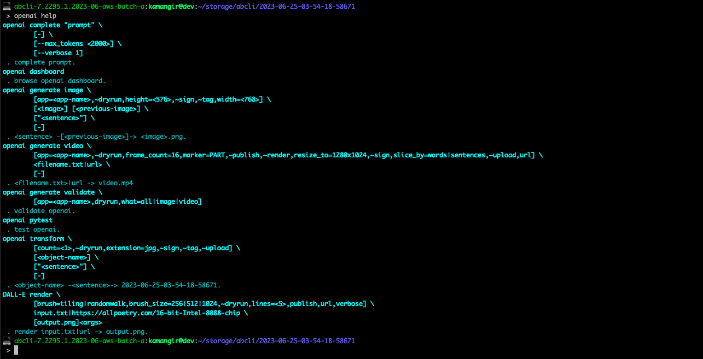

# openai

`openai` is a bash cli for [OpenAI API](https://beta.openai.com/docs/introduction).

## Install

Install [`awesome-bash-cli`](https://github.com/kamangir/awesome-bash-cli) (`abcli`), then,

```bash
abcli git clone openai install
openai help verbose
```



## Completion

```bash
openai complete "describe mathematics"
```

> Mathematics is an abstract science that examines topics such as quantity, structure, space, change, and other topics in various ways. It involves the use of logic, algorithms, and formulas to solve problems. Mathematics can be used to study the natural world, to describe phenomena, and to make predictions about the future. It provides the foundation for the development of a wide range of disciplines in science, technology, engineering, economics, finance, and more.

also works,

- [in a notebook](./notebooks/completion.ipynb).
- for [python functions](./notebooks/completion_ai_function_py.ipynb), special case: [image to image functions](./notebooks/completion_i2i_function.ipynb).
- [magic](./notebooks/two-dimensional.ipynb) using [Vancouver-Watching](https://github.com/kamangir/Vancouver-Watching).


## Sentence -> Image

```bash
abcli select; \
open .; \
openai generate image \
  ~dryrun,height=1024,width=1024 \
  carrot - \
  "an orange carrot walking on Mars."
```


## Text -> Mural

"[The Laughing Heart](  https://allpoetry.com/poem/14326890-The-Laughing-Heart-by-Charles-Bukowski)" by Charles Bukowski, [more examples](http://kamangir.net/private/?object=2023-03-26-19-10-26-51814).

```bash
abcli select; \
open .; \
DALL-E render  \
  ~dryrun,publish,url,verbose \
  https://allpoetry.com/poem/14326890-The-Laughing-Heart-by-Charles-Bukowski
```

