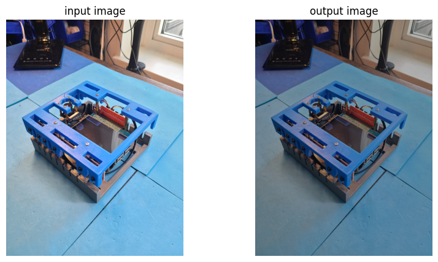
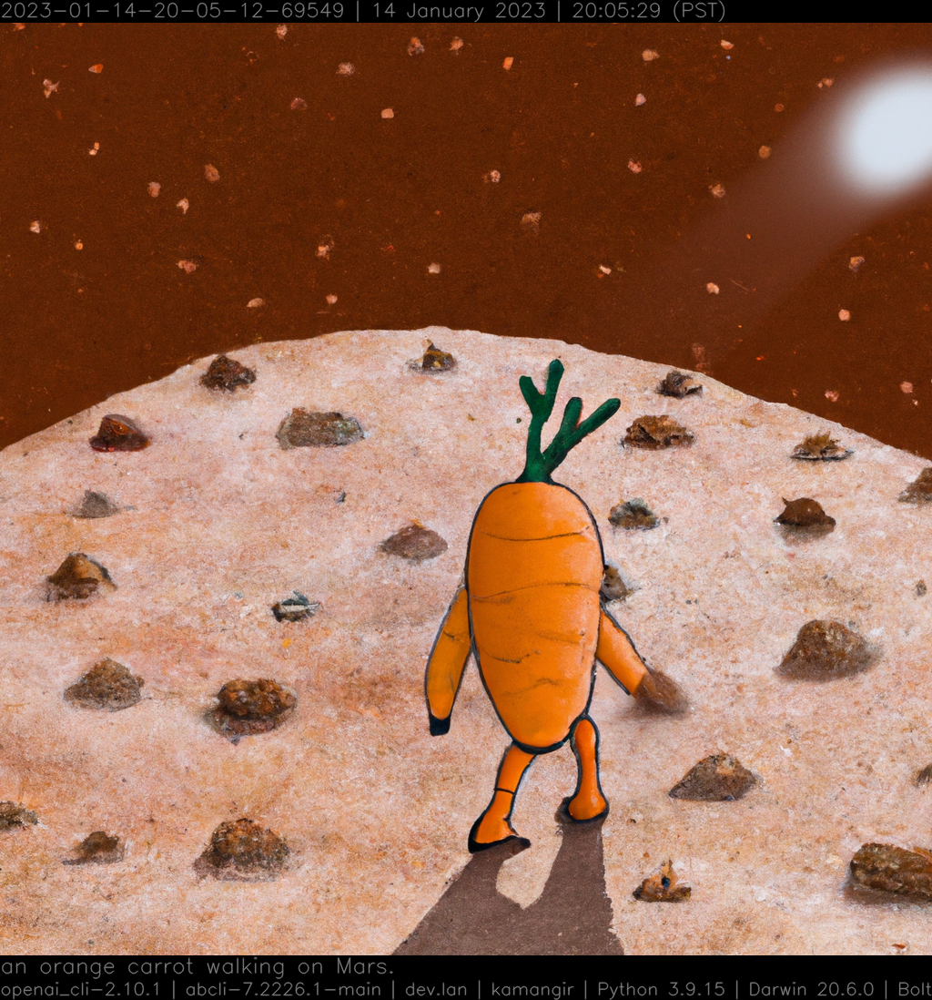
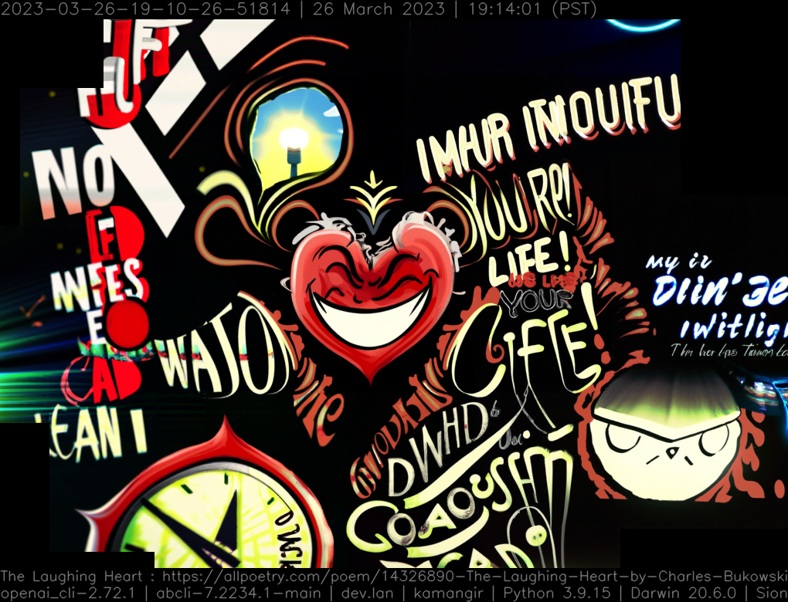

# 🛠️ openai-commands (`@openai`)

`@openai` is a bash interface to the [OpenAI API](https://beta.openai.com/docs/introduction).

🔷 [completion](#Completion) 🔷 [code generation](#code-generation) 🔷 [sentence -> image](#sentence---image) 🔷 [text -> mural](#text---mural) 🔷 [vision](#vision) 🔷 [images](#images) 🔷 [gpt](#gpt) 🔷 [VisuaLyze](#VisuaLyze) 🔷

## Install

Install [`awesome-bash-cli`](https://github.com/kamangir/awesome-bash-cli) (`abcli`), then,

```bash
abcli git clone openai-commands install
```

## Completion

```bash
@openai complete "describe mathematics"
```

> Mathematics is an abstract science that examines topics such as quantity, structure, space, change, and other topics in various ways. It involves the use of logic, algorithms, and formulas to solve problems. Mathematics can be used to study the natural world, to describe phenomena, and to make predictions about the future. It provides the foundation for the development of a wide range of disciplines in science, technology, engineering, economics, finance, and more.

also works [in a notebook](./notebooks/completion.ipynb).

## Code Generation

Example notebooks to [generate a python functions](./notebooks/completion_ai_function_py.ipynb), special case for [image to image python functions](./notebooks/completion_i2i_function.ipynb), and to [write a bash script](./notebooks/completion_ai_function_bash.ipynb) to use a script, for example, [vancouver-watching](https://github.com/kamangir/vancouver-watching).



## Sentence -> Image

```bash
@select - open; \
@openai generate image \
  ~dryrun,height=1024,width=1024 \
  carrot - \
  "an orange carrot walking on Mars."
```



## Text -> Mural

"[The Laughing Heart](https://allpoetry.com/poem/14326890-The-Laughing-Heart-by-Charles-Bukowski)" by Charles Bukowski, [more examples](http://kamangir.net/private/?object=2023-03-26-19-10-26-51814).

```bash
@select - open; \
DALL-E render  \
  ~dryrun,publish,url,verbose \
  https://allpoetry.com/poem/14326890-The-Laughing-Heart-by-Charles-Bukowski
```



## Vision

Implements the [OpenAI vision API](https://platform.openai.com/docs/guides/vision).

> GPT-4 with Vision ... `GPT-4V` or `gpt-4-vision-preview` in the API ... model ... take in images and answer questions about them
> ... not stateful ... ([more](https://arash-kamangir.medium.com/%EF%B8%8F-openai-vision-1-fb3691bd095a))

Example use on the images ingested from the traffic cameras in downtown Vancouver, using [vancouver-watching 🌈](https://github.com/kamangir/vancouver-watching),

```bash
@openai vision \
    "list some of the things that you see in these images." \
    - Davie,Bute,.jpg \
    $(vanwatch list area=vancouver,ingest,published \
        --log 0 \
        --count 1 \
        --offset 0) \
    --max_count 10 \
    --verbose 1
```

Or, equivalently,

```bash
vanwatch vision \
    "list some of the things that you see in these images." \
    area=vancouver,offset=0 \
    Davie,Bute
```

|  |  |  |  |
| -------------------------------------------------------------------------------------------------------------------- | -------------------------------------------------------------------------------------------------------------------- | ------------------------------------------------------------------------------------------------------------------- | ------------------------------------------------------------------------------------------------------------------- |


> The images show street scenes captured by surveillance cameras at night, and each bears a timestamp and the text "CITY OF VANCOUVER" indicating they're from Vancouver. In the first image, you see a yellow traffic light indicating caution and part of a crosswalk painted in rainbow colors, likely symbolizing support for the LGBTQ+ community. In the second image, there's a view of a city street with pedestrians crossing, some wearing reflective vests, and the storefronts illuminated with bright lights. The third image shows a different angle of a similar street scene with the same vibrant crosswalk and vehicles' headlights creating streaks of light due to the camera exposure. Finally, in the fourth image, there's a view of parked cars and a clearly visible police vehicle, suggesting the presence of law enforcement nearby. The wet pavement suggests it may have rained, and the reflections imply the street is well-lit at night.

## images

Implements the [OpenAI Image Generation API](https://platform.openai.com/docs/guides/images/usage?context=python).

Notebook implementation [`./notebooks/images.ipynb`](./notebooks/images.ipynb),

```bash
@select - open; \
@openai images generate - \
	"a person flying through the streets of Vancouver." \
	. --verbose 1
```


## gpt

co-authored with ChapGPT.

```bash
gpt
```

```bash
 > gpt help
gpt [dryrun,~upload] \
	[-|<object-name>] \
	[--model_name gpt-4-turbo-preview]
 . chat with gpt.
gpt list_models [-] \
	[--log 0]
 . list models.
```

## VisuaLyze

> How about calling it "VisuaLyze"? This name combines "visualize" and "analyze," reflecting the tool's capability to generate custom data visualizations and analyze user input through AI - OpenAI, [more](./openai_commands/VisuaLyze/)

```bash
VisuaLyze run
```


sample output for [`onlinefoods`](./assets/VisuaLyze/onlinefoods/).

```python
import pandas as pd
import matplotlib.pyplot as plt

def VisuaLyze(df: pd.DataFrame()):
    # Generate a matplotlib visualization of one aspect of the dataset

    # For example, let's say we want to visualize the distribution of ages in the dataset
    plt.figure(figsize=(10,6))
    df['Age'].hist(bins=20, color='skyblue', edgecolor='black')
    plt.title('Distribution of Ages in the Online Food Order Dataset')
    plt.xlabel('Age')
    plt.ylabel('Frequency')
    plt.show()
```
