# 🛠️ openai-commands (`@openai`)

`@openai` is a command interface to the [OpenAI API](https://beta.openai.com/docs/introduction).

```bash
pip install openai-commands
```

```mermaid
graph LR
    complete["@openai<br>complete<br>&lt;prompt&gt;"]

    text["📜 text"]:::folder

    text --> complete
    complete --> text

    classDef folder fill:#999,stroke:#333,stroke-width:2px;
```




|   |   |   |
| --- | --- | --- |
| [`prompt completion`](./openai_commands/completion#%EF%B8%8F-prompt-completion) [](./openai_commands/completion#%EF%B8%8F-prompt-completion)  | [`vision`](./openai_commands/vision) [](./openai_commands/vision) a command interface to the [OpenAI vision API](https://platform.openai.com/docs/guides/vision). | [`literature review`](./openai_commands/literature_review) [](./openai_commands/literature_review) literature review using OpenAI API. |
| [`code generation`](./openai_commands/completion#%EF%B8%8F-code-generation) [](./openai_commands/completion#%EF%B8%8F-code-generation) example notebooks to [generate python functions](./notebooks/completion_ai_function_py.ipynb), special case for [image to image python functions](./notebooks/completion_i2i_function.ipynb), and to [write a bash script](./notebooks/completion_ai_function_bash.ipynb) to use a script, for example, [vancouver-watching](https://github.com/kamangir/vancouver-watching). | [`image generation`](./openai_commands/images) [](./openai_commands/images) sentence -> image, text -> mural, images |  |

---

🎁 [wish list and bugs](https://github.com/kamangir/openai-commands/issues/13)


[](https://github.com/kamangir/openai-commands/actions/workflows/pylint.yml) [](https://github.com/kamangir/openai-commands/actions/workflows/pytest.yml) [](https://github.com/kamangir/openai-commands/actions/workflows/bashtest.yml) [](https://pypi.org/project/openai-commands/) [](https://pypistats.org/packages/openai-commands)

built by 🌀 [`blue_options-4.200.1`](https://github.com/kamangir/awesome-bash-cli), based on [`openai_commands-3.212.1`](https://github.com/kamangir/openai-commands).
