# 🛠️ openai-commands (`@openai`)

`@openai` is a command interface to the [OpenAI API](https://beta.openai.com/docs/introduction).

```bash
pip install openai-commands
```

```mermaid
graph LR
    openai_complete["@openai<br>complete<br>&lt;prompt&gt;"]

    openai_generate_image["@openai<br>generate_image<br>filename=&lt;filename.png&gt;<br>&lt;prompt&gt;<br>&lt;object-name&gt;"]

    openai_vision["@openai<br>vision - -<br>&lt;prompt&gt;<br>&lt;object-name&gt;"]

    litrev["@litrev<br>question=&lt;question&gt;<br>&lt;object-name&gt;"]
    litrev_multiple["@litrev<br>multiple<br>questions=&lt;question1+question2+...&gt;<br>to=&lt;runner&gt; -<br>&lt;object-name&gt;"]
    litrev_combine["@litrev<br>combine -<br>&lt;object-name-1&gt;<br>&lt;object-name-2&gt;<br>&lt;object-name&gt;"]

    text["📜 text"]:::folder
    image["🖼️ image"]:::folder
    object_1["object 1"]:::folder
    object_2["object 2"]:::folder
    object_3["object 3"]:::folder

    text --> openai_complete
    openai_complete --> text

    text --> openai_generate_image
    openai_generate_image --> image

    image --> openai_vision
    openai_vision --> text

    object_1 --> litrev
    litrev --> object_1

    object_1 --> litrev_combine
    object_2 --> litrev_combine
    litrev_combine --> object_3

    object_1 --> litrev_multiple
    litrev_multiple --> object_1
    litrev_multiple --> litrev
    litrev_multiple --> litrev_combine

    classDef folder fill:#999,stroke:#333,stroke-width:2px;
```




|   |   |
| --- | --- |
| [`literature review`](./openai_commands/literature_review) [](./openai_commands/literature_review)  | [`prompt completion`](./openai_commands/prompt_completion) [](./openai_commands/prompt_completion)  |
| [`image generation`](./openai_commands/images) [](./openai_commands/images)  | [`vision`](./openai_commands/vision) [](./openai_commands/vision)  |

---

🎁 [wish list and bugs](https://github.com/kamangir/openai-commands/issues/13)


[](https://github.com/kamangir/openai-commands/actions/workflows/pylint.yml) [](https://github.com/kamangir/openai-commands/actions/workflows/pytest.yml) [](https://github.com/kamangir/openai-commands/actions/workflows/bashtest.yml) [](https://pypi.org/project/openai-commands/) [](https://pypistats.org/packages/openai-commands)

built by 🌀 [`blue_options-4.207.1`](https://github.com/kamangir/awesome-bash-cli), based on [`openai_commands-3.242.1`](https://github.com/kamangir/openai-commands).
