# 🛠️ openai-commands (`@openai`)

`@openai` is a command interface to the [OpenAI API](https://beta.openai.com/docs/introduction).

```bash
pip install openai-commands
```

```mermaid
graph LR
    openai_complete["@openai complete <prompt>"]

    openai_generate_image["@openai generate_image filename=<filename.png> <prompt> <object-name>"]

    litrev["@litrev question=<question> <object-name>"]
    litrev_multiple["@litrev multiple questions=<question1+question2+...> to=<runner>~~- <object-name>"]
    litrev_combine["@litrev combine~~- <object-name-1> <object-name-2> <object-name>"]

    text["📜 text"]:::folder
    image["🖼️ image"]:::folder
    object["object"]:::folder
    object_2["object 2"]:::folder
    object_3["object 3"]:::folder

    text --> openai_complete
    openai_complete --> text

    text --> openai_generate_image
    openai_generate_image --> image

    object --> litrev
    litrev --> object

    object --> litrev_combine
    object_2 --> litrev_combine
    litrev_combine --> object_3

    object --> litrev_multiple
    litrev_multiple --> object
    litrev_multiple --> litrev
    litrev_multiple --> litrev_combine

    classDef folder fill:#999,stroke:#333,stroke-width:2px;
```




--table--

---

🎁 [wish list and bugs](https://github.com/kamangir/openai-commands/issues/13)

--signature--